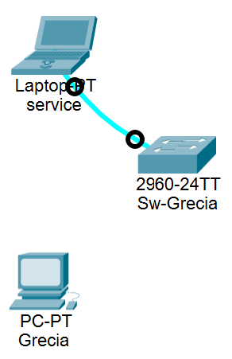
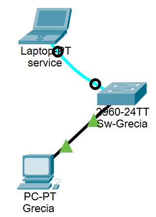

# Curs: Nisioi Sergiu
# Laborator: Dragan Mihaita

## Table of contents
1. [Switch](#1-switch)
   + [Setup](#setup)
   + [Terminal](#terminal)
   + [Testarea echipamentului](#testarea-echipamentului)
2. [Router](#2-router)
   + [Setup](#setup-1)
   + [Terminal](#terminal-1)

## 1. Switch

### Setup

+ Click pe \[End Devices\], click pe PC, click **in coltul din stanga jos** al spatiului de lucru
+ Click pe numele lui \(PC0\), sterge numele, scrie "Grecia"
+ Click pe monitorul calculatorului
+ **Power off**
+ Scroll in jos pana la placa de retea, drag & drop in sectiunea Modules, cauta in sectiunea Modules placa cu **CGE** \(PT-HOST-NM-1CGE\), drag & drop in locul placii de retea
+ **Power on**
+ Schimba de pe tabul _physical_ pe tabul _desktop_
+ Intra pe **IP Configuration**
  + IPv4 Address: `174.40.20.22`
  + Subnet Mask: `255.255.254.0`
  + Default Gateway: `174.40.20.1` \(cel mai mic IP posibil asignabil\)
  + DNS Server: `209.165.200.254`
+ Inchide de la x-ul mic
+ Intra pe **Email**
  + Your Name: `Grecia` \(numele PC-ului\)
  + Email Address: `Grecia@info.ro`
  + Incoming Mail Server: `209.165.200.254`
  + Outgoing Mail Server: `209.165.200.254`
  + User Name: `Grecia`
  + Password: `123456`
+ Click **Save**
+ \(optional\) Click **Configure Email**, verific daca am scris corect
+ Click pe \[Network Devices\], click pe \[Switches\], click pe **2960**, click **la cativa centimetri mai sus si mai la dreapta fata de PC**
+ Click pe numele lui \(Switch0\), sterge numele, scrie "Sw-Grecia"
+ Click pe \[End Devices\], click pe Laptop, click **la cativa centimetri mai sus si mai la stanga fata de Switch**
+ Click pe \[Connections\], click pe _Console_, click pe Switch, click pe **Console**, click pe Laptop, click pe **RS 232**

+ Click pe Laptop
+ Schimba de pe tabul _physical_ pe tabul _desktop_
+ Intra pe **Terminal**
+ Click **OK**
+ Apasa **Enter**

### Terminal
Apasa **Enter** dupa fiecare comanda  

switch\#  
```
enable
configure terminal
```
switch\(config\)\#
```
no ip domain lookup
hostname Sw-Grecia
```
Sw-Grecia\(config\)\#
```
no cdp run
service password-encryption
enable secret ciscosecpa55
enable password ciscoenapa55
banner motd $Vineri 14.03.2025 la ora 9:00 va avea loc sedinta IT!$
line console 0
```
Sw-Grecia\(config-line\)\#
```
password ciscoconpa55
login
logging synchronous
exec-timeout 20 10
exit
```
Sw-Grecia\(config\)\#
```
line vty 0 15
```
Sw-Grecia\(config-line\)\#
```
password ciscovtypa55
login
logging synchronous
exec-timeout 5 5
end
```
Sw-Grecia\#
> **IMPORTANT**
> Comanda asta salveaza configuratia. O poti rula oricand vrei, cand esti in Sw-Grecia\#
```
copy running-config startup-config
```
+ **Enter** \(intrebare despre nume\)
```
clock set HH:MM:SS D Mon YYYY
configure terminal
```
Sw-Grecia\(config\)\#
```
ip domain name info.ro
username Admin01 privilege 15 secret Admin01pa55
line vty 0 15
```
Sw-Grecia\(config-line\)\# 
```
transport input ssh
login local
exit
```
Sw-Grecia\(config\)\#
```
crypto key generate rsa
```
+ `2048`, **Enter** \(intrebare despre biti\)
```
ip ssh version 2
logging host 209.165.200.254
service timestamps log datetime msec
service timestamps debug datetime msec
interface vlan 1
```
Sw-Grecia\(config-if\)\#
```
description legatura cu reteaua 174.40.20.0/23
ip address 174.40.20.2 255.255.254.0
no shutdown
exit
```
Sw-Grecia\(config\)\# 
```
ip default-gateway 174.40.20.1
exit
```

### Testarea echipamentului

+ Click pe \[Connections\], click pe _Copper Straight-Through_, click pe Switch, click pe **GigabitEthernet 0/2**, click pe PC, click pe **GigabitEthernet0**
+ Click pe PC, click pe **Command Prompt**

Sw-Grecia\#
```
ping 174.40.20.2
ssh -l Admin01 174.40.20.2
```
+ `Admin01pa55`



## 2. Router

Schimbari in setul de date:  
| Anglia |     | Sw-Anglia |
| :----: | :-: | :-------: |
| 171.160.1.61 | IPv4 Address | 171.160.0.2  |
| 255.255.224.0 | Subnet Mask | 255.255.224.0 |
| 171.160.0.1 | Default Gateway | 171.160.0.1 |
| 171.160.47.254| DNS Server

### Setup

+ Click pe \[Network Devices\], click pe \[Routers\], click pe **2911** sau pe **2901**, click **la cativa centimetri mai la dreapta fata de PC**
+ Click pe numele lui (Router0), sterge numele, scrie "R-Anglia"
+ **Power off**
+ Scroll in jos pana la placa de retea, drag & drop in sectiunea Modules, cauta in sectiunea Modules placa cu **HWIC-2T**, drag & drop **cat mai aproape de sursa**
+ **Power on**
+ Click pe bulina dinspre Switch de pe cablul _Console_ Laptop-Switch, click pe Router, click pe **Console**
+ Click pe Laptop
+ Schimba de pe tabul _physical_ pe tabul _desktop_
+ Intra pe **Terminal**
+ Click **OK**
+ Interogare: `NO`, **Enter**
+ Apasa **Enter**

### Terminal
Apasa **Enter** dupa fiecare comanda  

router\#  
```
enable
configure terminal
```
router\(config\)\#
```
no ip domain lookup
hostname R-Anglia
```
R-Anglia\(config\)\#
```
no cdp run
service password-encryption
security passwords min-length 10
login block-for 50 attempts 3 within 20
enable secret ciscosecpa55
enable password ciscoenapa55
banner login $Accesul persoanelor neautorizate este strict interzis!$
banner motd $Vineri 21.03.2025 la ora 14:00 serverul va fi oprit!$
line console 0
```
R-Anglia\(config-line\)\#
```
password ciscoconpa55
login
logging synchronous
exec-timeout 20 10
exit
```
R-Anglia\(config\)\#
```
line vty 0 15
```
R-ANglia\(config-line\)\#
```
password ciscovtypa55
login
logging synchronous
exec-timeout 5 5
end
```
R-Anglia\#
> **IMPORTANT**
> Comanda asta salveaza configuratia. O poti rula oricand vrei, cand esti in R-Anglia\#
```
copy running-file startup-config
```
+ **Enter** \(intrebare despre nume\)
```
clock set HH:MM:SS D Mon YYYY
configure terminal
```
R-Anglia\(config\)\#
```
ip domain name info.ro
username Admin01 privilege 15 secret Admin01pa55
line vty 0 15
```
R-Anglia\(config-line\)\# 
```
transport input ssh
login local
exit
```
R-Anglia\(config\)\#
```
crypto key generate rsa
```
+ `2048`, **Enter** \(intrebare despre biti\)
```
ip ssh version 2
logging host 209.165.200.254
service timestamps log datetime msec
service timestamps debug datetime msec
interface gigabitethernet 0/0
```
R-Anglia\(config-if\)\#
```
description legatura cu reteaua 171.160.0.0/19
ip address 171.160.0.1 255.255.224.0
no shutdown
exit
```
R-Anglia\(config\)\# 
```
interface serial 0/0/0
```
R-Anglia\(config-if\)\#
```
description legatura cu routerul R-server
ip address 171.160.56.5 255.255.255.252
no shutdown
```
